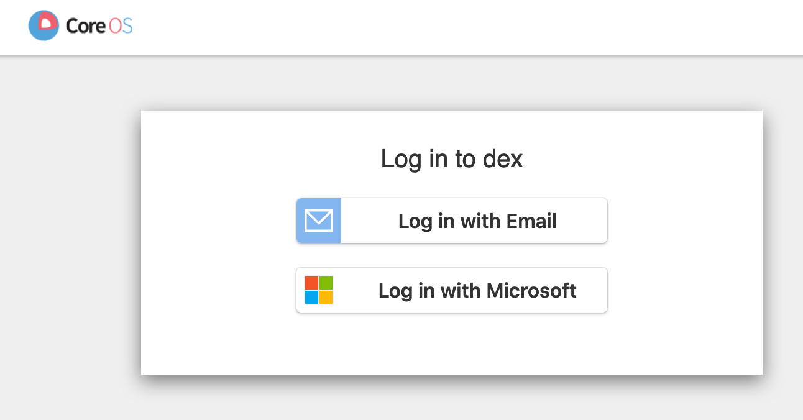

# Kubernetes DEX authenticator with azuread connection

The traffic controlled by [oauth2 proxy](https://github.com/oauth2-proxy/oauth2-proxy) service, if the authentication against [dex authenticator](https://github.com/dexidp/dex) is successfull then the Nginx server will be shown.

Dex will connect to [Azure Active directory](https://azure.microsoft.com/en-us/services/active-directory/), if the user exist in the user database, then the connection will succeed.
Several [connector](https://github.com/dexidp/dex#connectors) can be added to dex as well as static users.

**Steps:**
oauth2_proxy:

dex:

And finally our service:

## pre-requisites:
To run this use-case you need:
- An azure account
- External DNS or similar that pushes the ingress resources into the DNS zone
- A kubernetes Ingress controller
- SSL termination at the ingress controller

then the required tools:
- kubectl
- [helm](https://helm.sh)
- [helm diff](https://github.com/databus23/helm-diff)
- [helmfile](https://github.com/roboll/helmfile)
- Make

## Configure the project
- create an [azureAD application](https://docs.pivotal.io/p-identity/1-11/azure-oidc/config-azure.html)
- configure the AAD application to do URL redirect to `https://dex.<DNS_ZONE_NAME>`
- update the `aad-app-conf.env.tmpl` to set the correct values and save it as `aad-app-conf.env`

## How to run
Just run `make run`

Then access the following url: `https://proxy.<DNS_ZONE_NAME>`

## how to destroy
Just run `make destroy`